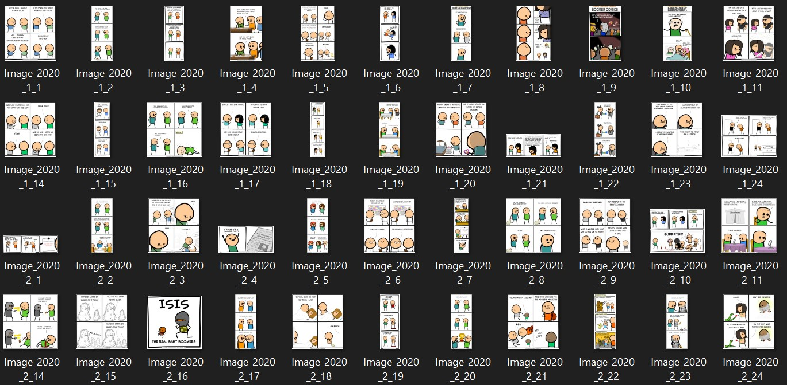

# Comic_Scrap

Install the requirements before running python script using the given command.
pip install -r requirements.txt

The script will ask for an year. Enter the year for which you want comics strips from explosm.net.
PS: Please check that you don't have a folder named "comics" in working directory.

Please wait for a couple of minutes for the script to get all the images.
(yes, you are going to get more than 100 comics...they are worth waiting)

END RESULT

Happy Reading :p
